<p align="center">
  
</p>

<h1 align="center">🦋 Thynqit Flutter Accelerator</h1>

<p align="center">
  <b>Enterprise Cross-Platform Mobile Architecture Blueprint</b>
</p>

<p align="center">
  
  
  
  
  
  
  
  
  
</p>

---

## ⚠️ Usage & Licensing Notice

This repository is **public for reference purposes only**.

- 🚫 Forking is discouraged
- 🚫 External contributions are not accepted
- 🚫 Commercial or production use is not permitted
- ✅ Intended for understanding Thynqit's engineering practices

For collaboration or licensing inquiries, please contact Thynqit at **connect@thynqit.com**

---

## 📌 Overview

The **Thynqit Flutter Accelerator** is an enterprise-grade cross-platform mobile blueprint designed to standardize how scalable, maintainable, secure, and production-ready Flutter applications should be architected, structured, developed, tested, and deployed.

Unlike typical starter kits or Flutter boilerplates, this accelerator focuses on:

- ⚡ Rapid cross-platform application development enablement
- 🧱 Scalable feature-first mobile architecture
- 🎨 Consistent UI and design system implementation
- 🔒 Secure mobile engineering practices
- 📱 Adaptive Android and iOS user experiences
- ☁️ Cloud-ready deployment architecture
- 📊 Built-in observability and monitoring
- 🔥 Firebase-first mobile ecosystem integration
- 🌐 Multi-platform delivery from a single codebase
- 🚀 Enterprise-grade engineering foundation

---

## ⚡ Architecture Snapshot

- Architecture: Clean Architecture + Feature-First Modular Architecture
- Language: Dart
- Framework: Flutter
- State Management: Riverpod (BLoC compatible)
- UI Framework: Material 3 + Cupertino + Adaptive UI
- Navigation: GoRouter
- Networking: REST, GraphQL, WebSockets
- Local Storage: Hive, SharedPreferences, Secure Storage
- Database: SQLite (Drift), Isar (Optional)
- Firebase: Analytics, Crashlytics, Remote Config, Cloud Messaging, Performance Monitoring
- Security: SSL Pinning, Secure Storage, Biometrics, Root/Jailbreak Detection
- Performance: Lazy Loading, Image Optimization, Offline Synchronization
- CI/CD: GitHub Actions, Codemagic, Fastlane
- Observability: Logging, Monitoring, Analytics, Crash Reporting
- Deployment: Android, iOS, Web, Desktop-ready

---

## 🎯 Why This Matters

Modern Flutter applications fail not because of the framework—but because of inconsistent architecture, fragmented state management, weak modularization, poor scalability planning, and missing operational capabilities.

This accelerator ensures:

- ✅ Consistent Flutter architecture across projects
- ✅ Faster onboarding of Flutter developers
- ✅ Reusable and scalable mobile engineering patterns
- ✅ Reduced technical debt and architectural fragmentation
- ✅ Production readiness from Day 1
- ✅ Better performance, reliability, and developer experience
- ✅ Faster feature delivery and release cycles
- ✅ Enterprise-grade security by default
- ✅ Offline-first mobile architecture
- ✅ Multi-platform engineering from a single codebase

---

## 💼 Business Impact

Using this accelerator delivers measurable outcomes:

- 🚀 70–80% faster Flutter project kickoff
- 💰 Reduced mobile development and maintenance cost
- ⚡ Faster feature delivery and release cycles
- 👨‍💻 Faster onboarding for Flutter developers
- 🧱 Consistent architecture across engineering teams
- 📱 Improved application performance and responsiveness
- 🔒 Stronger mobile security posture
- 📉 Reduced production defects
- ☁️ Faster CI/CD adoption
- 📊 Improved production monitoring and debugging
- 🔄 Better long-term maintainability
- 🌍 True multi-platform engineering foundation
- 📦 Increased code reuse across applications
- 📈 Improved developer productivity

---

## 🧭 Table of Contents

- [Overview](#-overview)
- [Architecture Snapshot](#-architecture-snapshot)
- [Why This Matters](#-why-this-matters)
- [Business Impact](#-business-impact)
- [Example Use Cases](#-example-use-cases)
- [Accelerator vs Traditional Setup](#-accelerator-vs-traditional-setup)
- [How Thynqit Uses This](#-how-thynqit-uses-this)
- [Core Principles](#-core-principles)
- [High-Level Architecture](#-high-level-architecture)
- [Request Flow](#-request-flow)
- [Application Flow](#-application-flow)
- [System Components](#-system-components)
- [Functional Capabilities](#-functional-capabilities)
- [Technology Stack Mapping](#-technology-stack-mapping)
- [Authentication Architecture](#-authentication-architecture)
- [Routing Architecture](#-routing-architecture)
- [Navigation Architecture](#-navigation-architecture)
- [Firebase Architecture](#-firebase-architecture)
- [Networking Architecture](#-networking-architecture)
- [State Management Strategy](#-state-management-strategy)
- [Widget Architecture](#-widget-architecture)
- [Theme & Design System](#-theme--design-system)
- [Offline-First Architecture](#-offline-first-architecture)
- [Security Architecture](#-security-architecture)
- [Observability Architecture](#-observability-architecture)
- [Testing Strategy](#-testing-strategy)
- [Deployment Architecture](#-deployment-architecture)
- [Project Structure](#-project-structure)
- [Versioning](#-versioning)
- [Future Enhancements](#-future-enhancements)
- [Who Should Use Thynqit Accelerator](#-who-should-use-thynqit-accelerator)
- [Engineering Philosophy](#-engineering-philosophy)
- [Work With Us](#-work-with-us)
- [Contributing](#-contributing)
- [License](#-license)

---

### 🧪 Example Use Cases

- Enterprise Mobile Applications
- FinTech Mobile Platforms
- E-commerce Applications
- Healthcare & Telemedicine Apps
- Logistics & Supply Chain Applications
- SaaS Mobile Applications
- AI-native Mobile Products
- Real-Time Mobile Applications
- Multi-tenant Enterprise Applications
- Internal Enterprise Mobility Solutions

---

## 🆚 Accelerator vs Traditional Setup

| Traditional Setup | Thynqit Accelerator | Time / Effort Saved |
| ----------------- | ------------------- | ------------------- |
| Fragmented project structure | Standardized feature-first architecture | Faster decisions (1–2 weeks) |
| Repeated project setup | Pre-defined scalable foundation | Reduced setup time (2–3 weeks) |
| Inconsistent state management | Riverpod-first architecture | Reduced rework |
| Weak Firebase integration | Production-ready Firebase ecosystem | Faster integration (1 week) |
| Scattered networking implementation | Centralized networking architecture | Faster development |
| Limited offline capabilities | Offline-first architecture | Better reliability |
| Weak monitoring | Built-in observability | Faster debugging |
| Manual deployment pipelines | Automated CI/CD pipelines | Faster releases |
| Inconsistent security implementation | Enterprise security foundation | Improved compliance |

*On average, teams can accelerate Flutter application setup by **70–80%** using this accelerator.*

---

## 🏢 How Thynqit Uses This

This accelerator is used internally across Thynqit's cross-platform engineering projects to:

- Kickstart scalable Flutter applications within hours
- Maintain engineering consistency across teams
- Deliver production-ready mobile systems faster
- Standardize Flutter architecture and engineering practices
- Reduce repetitive setup and architectural overhead
- Accelerate feature delivery with reusable engineering foundations
- Build Android and iOS applications from a single codebase
- Enable long-term maintainability across enterprise products

---

## 🧱 Core Principles

It represents the foundational Flutter architectural guidelines that define how scalable, maintainable, secure, and production-ready cross-platform mobile applications should be designed, structured, developed, and evolved across enterprise engineering teams. These principles establish a consistent engineering foundation that standardizes feature modularization, state management, networking, security, observability, offline synchronization, performance optimization, testing, and deployment practices—ensuring that applications remain scalable, reliable, and adaptable as business requirements, engineering complexity, and user scale continue to grow.

### 🧩 Best Practices

- Clean Architecture
- Feature-First Modular Architecture
- Cross-Platform Engineering
- Riverpod-First State Management
- Offline-First Mobile Engineering
- Firebase-First Ecosystem Integration
- Secure-by-Design Architecture
- Reusable Widget & Design Systems
- Centralized Configuration Management
- Observability by Default
- Performance Optimization by Default
- Config-Driven Mobile Systems

---

## 🏢 High-Level Architecture

High-Level Architecture defines the foundational structural blueprint of the Flutter application by organizing it into clearly separated layers such as presentation, state management, business logic, networking, local storage, and backend integrations. This layered architecture establishes clear boundaries of responsibility, ensuring that each layer can evolve independently without introducing unnecessary coupling, architectural inconsistencies, or maintainability challenges.

The accelerator follows a scalable Clean Architecture approach combined with feature-first engineering principles to improve maintainability, testability, reusability, operational visibility, and long-term scalability across enterprise mobile systems. By standardizing how widgets, providers, repositories, and backend services interact, the architecture enables teams to rapidly build, extend, and maintain Flutter applications while preserving engineering consistency, mobile reliability, performance optimization, and developer productivity.

This architecture also embeds critical enterprise concerns such as offline-first engineering, Firebase ecosystem integration, observability, security, multi-environment support, adaptive user interfaces, and CI/CD readiness directly into the foundation rather than treating them as isolated implementations added later in the development lifecycle.

### 🧩 Best Practices

- Clean Architecture with clear separation of concerns
- Feature-first modular project structure
- Riverpod-driven state management
- Repository and Use Case abstraction layers
- Offline-first mobile engineering principles
- Firebase-first operational ecosystem integration
- Reusable widget and design systems
- Centralized networking and API abstraction
- Config-driven environment management
- Observability and monitoring by default
- Secure-by-design mobile architecture
- Performance optimization and scalable mobile delivery

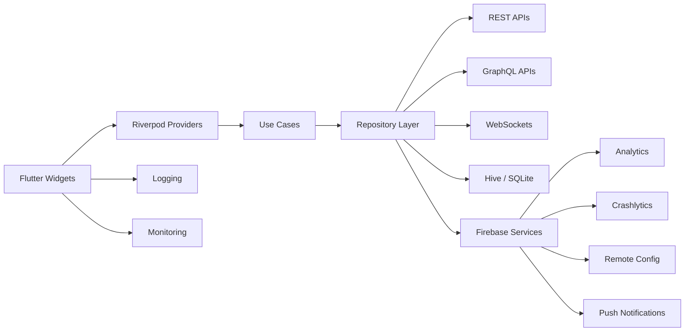

---

## 🔁 Request Flow

Request Flow defines the standardized lifecycle of how user interactions, application state changes, local data operations, and backend communication move through the Flutter application—from Widgets to Riverpod providers, business logic layers, repositories, APIs, local storage systems, and back to the user interface as updated application state.

Establishing a consistent request lifecycle ensures predictable application behavior, improves debugging and observability, simplifies lifecycle management, and reduces architectural inconsistencies across teams. By standardizing how requests are triggered, validated, processed, cached, synchronized, and rendered, the accelerator improves scalability, reliability, maintainability, offline resilience, and developer productivity across enterprise Flutter applications.

The request flow architecture also incorporates modern Flutter engineering practices such as reactive state management, repository abstraction, offline-first synchronization, structured error handling, asynchronous processing, and centralized monitoring to ensure production-grade mobile reliability and operational visibility.

### 🧩 Best Practices

- Clear separation between UI, business logic, and data layers
- Riverpod-driven state management
- Repository-based API and local storage abstraction
- Centralized networking and request handling
- Offline-first synchronization strategies
- Structured error and exception handling
- Reactive UI updates
- Widget-driven UI rendering
- Optimized asynchronous lifecycle management
- Centralized logging, analytics, and monitoring integration

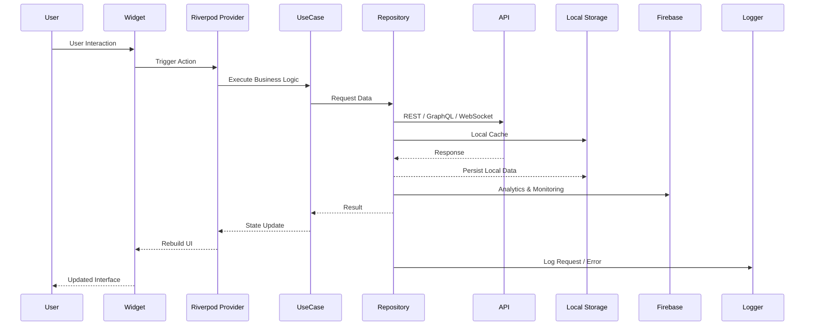

---

## 🔄 Application Flow

Application Flow defines the initialization and runtime lifecycle of the Flutter application, outlining how configurations are loaded, dependencies are initialized, Firebase services are configured, authentication state is restored, local storage systems are prepared, networking layers are initialized, and the user interface is rendered into a production-ready state. By standardizing this startup and operational sequence, the accelerator ensures consistent and predictable behavior across multiple environments such as development, QA, UAT, staging, and production.

This structured initialization approach improves application reliability, reduces runtime inconsistencies, simplifies dependency orchestration, and ensures that critical application services such as analytics, monitoring, networking, local caching, feature flags, authentication, and observability are initialized in a controlled and scalable manner.

### 🧩 Best Practices

- Environment configuration validation
- Centralized application initialization
- Firebase bootstrapping
- Dependency injection initialization
- Authentication and session restoration
- Offline cache preparation
- API client initialization
- Theme and preference persistence
- Lifecycle-aware state restoration
- Graceful startup failure handling
- Secure startup validation
- Scalable environment-driven startup orchestration

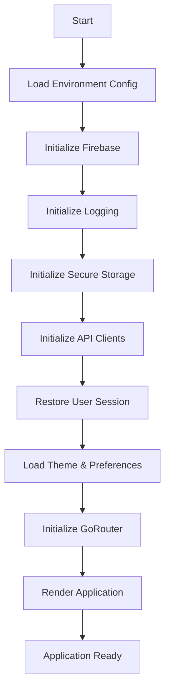

---

## 🧩 System Components

### 🎨 Presentation Layer

- Flutter Widgets
- Material 3 Design System
- Cupertino Widgets
- Adaptive Layouts
- Responsive UI Components
- Accessibility Support

---

### ⚙️ State & Business Layer

- Riverpod Providers
- StateNotifier / AsyncNotifier
- Use Cases
- Business Logic Isolation
- Repository Pattern
- Dependency Injection

---

### 🌐 Networking Layer

- REST API Clients
- GraphQL Clients
- WebSocket Clients
- API Interceptors
- Retry Policies
- API Caching

---

### 💾 Storage Layer

- Hive
- SharedPreferences
- Flutter Secure Storage
- SQLite (Drift)
- Offline Synchronization
- Local Caching

---

### 🔗 Cross-Cutting Concerns

- Logging
- Monitoring
- Crash Reporting
- Security
- Analytics
- Performance Monitoring
- Connectivity
- Localization
- Feature Flags

---

## 🧩 Functional Capabilities

The accelerator provides a comprehensive set of enterprise-grade Flutter engineering capabilities that establish a scalable, maintainable, secure, and production-ready foundation for modern cross-platform applications.

By standardizing critical engineering concerns such as architecture, state management, networking, offline storage, Firebase integration, security, observability, performance optimization, testing, CI/CD automation, and multi-environment management, the accelerator enables engineering teams to rapidly deliver high-quality Flutter applications while maintaining architectural consistency, operational reliability, mobile scalability, and long-term maintainability across enterprise ecosystems.

| Capability | Description | Impact |
|------------|-------------|--------|
| Environment Setup | Multi-environment support (dev, qa, uat, staging, prod) | Stability |
| State Management | Riverpod-first architecture | Predictability |
| Firebase | Complete Firebase ecosystem integration | Faster development |
| Networking | REST, GraphQL, WebSocket support | Scalability |
| Storage | Offline-first local storage architecture | Reliability |
| Security | Enterprise mobile security foundation | Compliance |
| Observability | Logging, crash tracking, monitoring | Faster debugging |
| CI/CD | GitHub Actions, Codemagic & Fastlane | Faster releases |
| Widget System | Reusable widget architecture | Faster UI delivery |
| Adaptive UI | Android, iOS & responsive layouts | Better UX |
| Testing | Unit, Widget & Integration testing | Better quality |
| Performance | Cross-platform optimization strategies | Better user experience |

---

## 🔧 Technology Stack Mapping

The accelerator is built using a carefully selected set of modern, industry-proven Flutter technologies, frameworks, and engineering tools to ensure scalability, performance, maintainability, security, and developer productivity across all layers of the application.

Each technology within the stack is intentionally chosen to support enterprise-grade Flutter engineering practices including feature-first modular architecture, reactive state management, offline-first capabilities, Firebase ecosystem integration, secure mobile communication, automated testing, observability, and cloud-ready CI/CD delivery pipelines—providing teams with a stable and extensible foundation for building production-scale cross-platform applications.

| Capability | Tools / Frameworks | Purpose |
|------------|--------------------|---------|
| Language | Dart | Modern cross-platform development |
| Framework | Flutter | Cross-platform application framework |
| Architecture | Clean Architecture | Scalable application architecture |
| State Management | Riverpod | Reactive state management |
| Dependency Injection | Riverpod / GetIt | Dependency management |
| Navigation | GoRouter | Declarative navigation |
| Networking | Dio | REST communication |
| GraphQL | graphql_flutter | GraphQL support |
| WebSockets | web_socket_channel | Real-time communication |
| Database | Drift / Isar | Local database |
| Storage | Hive, SharedPreferences | Local persistence |
| Secure Storage | flutter_secure_storage | Secure credential storage |
| Firebase | Firebase Suite | MBaaS & monitoring |
| Authentication | Firebase Auth, OAuth | Authentication |
| Biometrics | local_auth | Biometric authentication |
| Serialization | freezed, json_serializable | Immutable models |
| Async Processing | Dart Futures & Streams | Async operations |
| Testing | flutter_test, mocktail, integration_test | Testing framework |
| Static Analysis | flutter_lints, very_good_analysis | Code quality |
| CI/CD | GitHub Actions, Codemagic, Fastlane | Delivery automation |
| Monitoring | Firebase Crashlytics, Sentry | Crash monitoring |
| Environment | flutter_dotenv | Environment configuration |

---

## 🔐 Authentication Architecture

Authentication Architecture defines how user identity, session management, access control, token lifecycle handling, and secure application access are managed across the Flutter application.

The accelerator provides a scalable and extensible authentication foundation that supports secure login flows, session persistence, role and permission-based access control, biometric authentication, secure token storage, and environment-driven authentication configurations while remaining flexible enough to integrate with multiple backend authentication providers and enterprise identity systems.

By centralizing authentication concerns, the accelerator ensures consistent security practices, improves maintainability, reduces duplicated authentication implementations, and simplifies secure cross-platform application development across teams.

The authentication architecture is designed to support modern authentication approaches including Firebase Authentication, OAuth2, OpenID Connect, Single Sign-On (SSO), Multi-Factor Authentication (MFA), enterprise identity providers, social login providers, and custom authentication services.

### 🧩 Best Practices

- Centralized authentication management
- Secure token and session handling
- Biometric authentication support
- Encrypted credential persistence
- Role and permission-based access control
- Authentication state restoration
- Automatic token refresh
- Environment-driven authentication configuration
- Graceful session expiration
- Secure API communication
- Firebase Authentication integration
- Enterprise SSO readiness

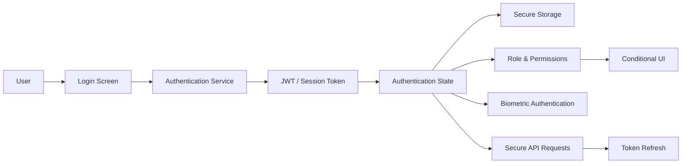

---

## 🧭 Routing Architecture

Routing Architecture defines how application-level navigation, deep linking, feature routing, authentication-aware navigation, and route orchestration are structured across the Flutter application.

The accelerator standardizes routing through GoRouter to simplify navigation management while supporting nested routes, shell routes, authentication guards, deep links, feature modules, and scalable navigation hierarchies.

### 🧩 Best Practices

- Centralized route configuration
- GoRouter-based navigation
- Authentication-aware routing
- Shell routes
- Nested feature routing
- Deep linking support
- Route guards
- Navigation state restoration
- Modular routing
- Environment-aware routing

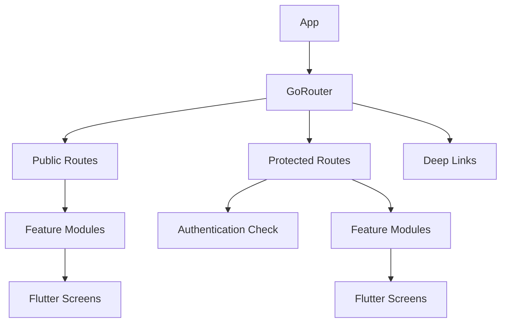

---

## 🧭 Navigation Architecture

Navigation Architecture defines how users move throughout the Flutter application using reusable navigation components, adaptive layouts, nested navigation, and platform-aware navigation patterns.

The accelerator provides a centralized navigation foundation supporting Android and iOS experiences while remaining responsive across tablets, foldables, desktop, and web.

### 🧩 Best Practices

- Bottom Navigation
- Navigation Drawer
- Navigation Rail
- Tab Navigation
- Nested Navigation
- Adaptive Navigation
- Deep Link Support
- Role-aware Navigation
- Responsive Navigation
- Reusable Navigation Components
- Navigation State Restoration
- Platform-adaptive Navigation

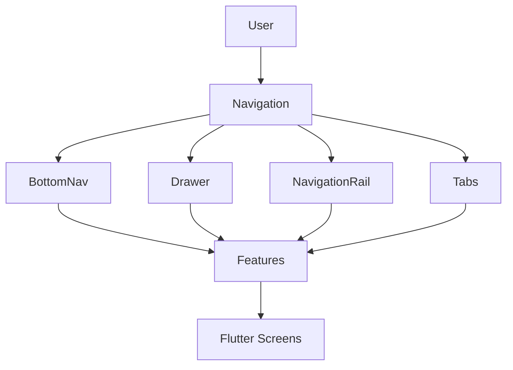

---

## 🔥 Firebase Architecture

Firebase Architecture defines how the Flutter application integrates with Firebase services to enable analytics, crash reporting, remote configuration, push notifications, feature management, application monitoring, and operational visibility.

The accelerator provides a centralized Firebase integration strategy that standardizes initialization, configuration, environment management, monitoring, and event tracking while maintaining clean architectural boundaries.

By embedding Firebase deeply into the engineering foundation, the accelerator improves production observability, accelerates feature rollout strategies, simplifies backend integrations, and reduces repetitive Firebase setup effort across projects.

### 🧩 Firebase Capabilities

- Firebase Analytics
- Firebase Crashlytics
- Firebase Performance Monitoring
- Firebase Remote Config
- Firebase Cloud Messaging
- Firebase App Check
- Firebase In-App Messaging
- Firebase App Distribution

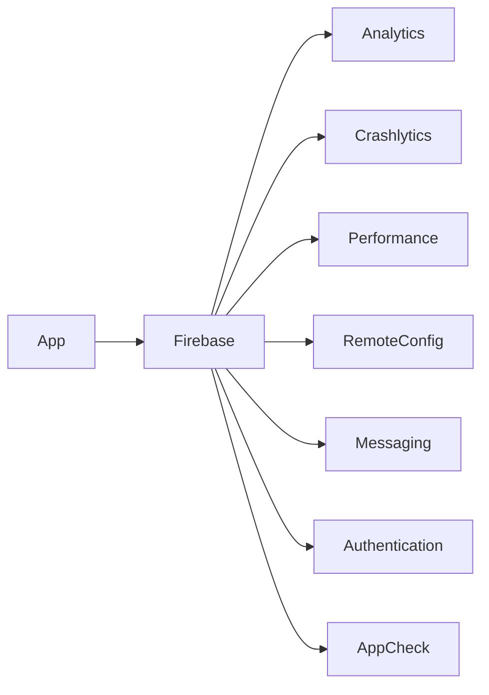

---

## 🌐 Networking Architecture

Networking Architecture defines how the Flutter application communicates with backend services, APIs, and real-time systems while maintaining scalability, reliability, security, and maintainability.

The accelerator provides a centralized networking foundation built around repository abstractions, Dio interceptors, API clients, retry strategies, offline synchronization, and structured error handling.

The networking layer supports REST APIs, GraphQL, WebSockets, secure authentication, response caching, request monitoring, and environment-specific API routing while remaining flexible enough to integrate with evolving backend ecosystems.

### 🧩 Best Practices

- Centralized API layer
- Dio interceptors
- REST communication
- GraphQL support
- WebSocket support
- Repository abstraction
- Offline-aware networking
- Request retry strategies
- Structured error handling
- API response caching
- Authentication interceptors
- Environment-aware API configuration

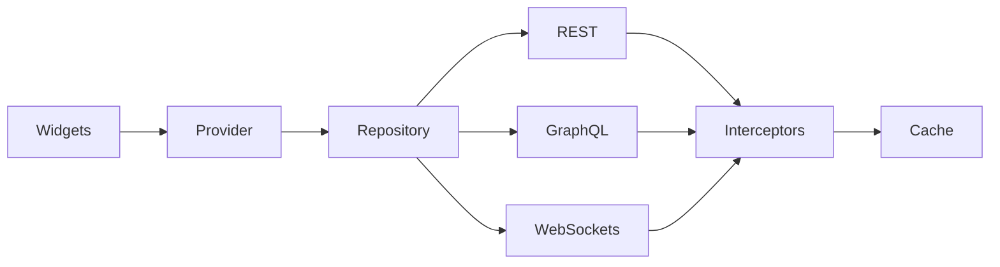

---

## 📦 State Management Strategy

State Management Strategy defines how application state, UI state, business state, authentication state, and server-side data are managed throughout the Flutter application.

The accelerator adopts a Riverpod-first approach because it provides compile-time safety, dependency injection, testability, scalability, and predictable reactive state updates while remaining flexible enough to support alternative approaches such as BLoC where required.

Instead of enforcing unnecessary complexity, the architecture promotes choosing the appropriate provider type based on feature complexity, lifecycle requirements, offline synchronization needs, and scalability goals.

### 🧩 Best Practices

- Riverpod-first architecture
- Separation of UI, domain, local, and remote state
- Reactive state updates
- Repository-driven state orchestration
- Feature-based state organization
- Authentication state management
- Theme and preference state
- Offline-aware synchronization
- Async state management
- Predictable UI rebuilding
- Minimal unnecessary global state
- BLoC compatibility when required

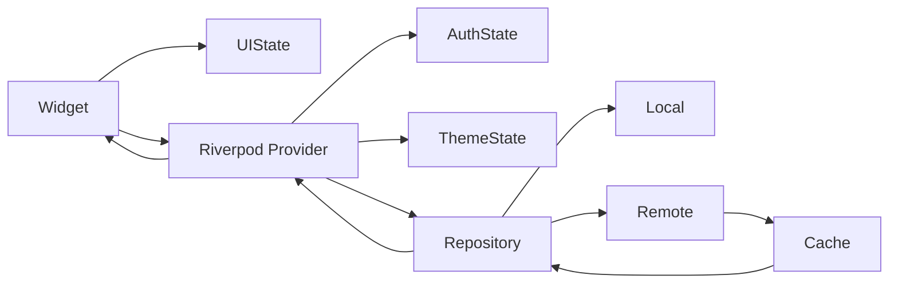

---

## 🎨 Widget Architecture

Widget Architecture defines how reusable Flutter widgets, layouts, themes, and interaction patterns are designed, organized, and scaled across the application. The accelerator promotes a widget-driven architecture where UI elements are built as modular, reusable, composable, and testable building blocks, enabling teams to maintain design consistency, accelerate UI development, simplify long-term maintenance, and scale applications across multiple feature modules and platforms.

By standardizing widget composition, state handling patterns, theming behavior, accessibility practices, and adaptive UI principles, the accelerator minimizes duplicated UI logic, improves developer productivity, and ensures a predictable Flutter development experience across engineering teams.

The widget architecture also incorporates enterprise concerns such as responsive layouts, adaptive Android and iOS experiences, centralized design tokens, reusable interaction patterns, localization, and scalable design systems to ensure maintainable and production-ready cross-platform applications.

### 🧩 Best Practices

- Reusable and composable widgets
- Feature-based widget organization
- Separation of UI and business logic
- Material 3 design system
- Theme-aware widget development
- Responsive and adaptive layouts
- Accessibility-first development
- Reusable navigation components
- Minimal widget duplication
- Stateless-first approach
- Lifecycle-aware widget composition
- Shared widget standards

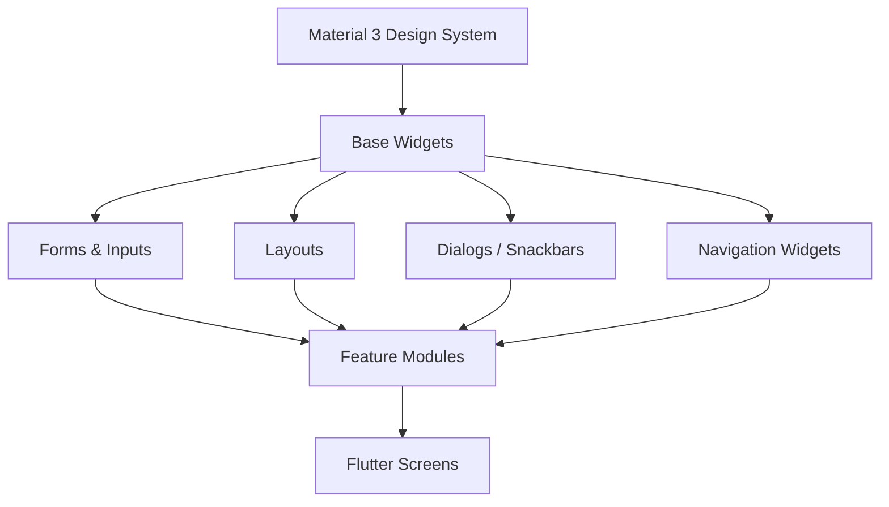

---

## 🎨 Theme & Design System

Theme & Design System defines the visual and interaction foundation of the Flutter application by standardizing colors, typography, spacing, layouts, component styling, animations, and interaction patterns across the entire application.

The accelerator provides a scalable and centralized design system that ensures UI consistency, improves developer productivity, simplifies branding, and enables applications to maintain a cohesive user experience as they evolve across multiple platforms and feature modules.

The design system supports Material 3, Cupertino widgets, adaptive layouts, light and dark themes, centralized design tokens, accessibility standards, and scalable multi-brand experiences.

### 🧩 Best Practices

- Centralized design tokens
- Material 3 support
- Cupertino support
- Light & Dark themes
- Dynamic theming
- Consistent typography
- Responsive spacing system
- Adaptive layouts
- Accessibility standards
- Reusable design components
- Multi-brand support
- Shared UI consistency

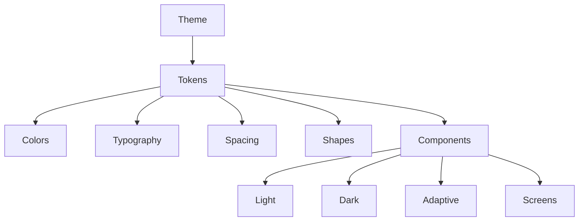

---

## 📱 Offline-First Architecture

Offline-First Architecture defines how the Flutter application continues to operate reliably under unstable, intermittent, or unavailable network conditions by prioritizing local persistence, resilient synchronization, intelligent caching, and background synchronization.

Rather than treating offline capabilities as optional enhancements, the accelerator embeds offline-first engineering into the application's core architecture to improve responsiveness, reliability, user trust, and operational resilience.

The architecture supports local-first repositories, synchronization queues, conflict resolution, retry mechanisms, cached API responses, and intelligent recovery strategies that ensure users can continue working even when connectivity is limited.

### 🧩 Capabilities

- Local-first repositories
- Hive & SQLite persistence
- Background synchronization
- Conflict resolution
- API response caching
- Retry synchronization
- Offline queue management
- Intelligent cache invalidation
- Connectivity awareness
- Stale data recovery
- Offline analytics buffering
- Repository-driven synchronization

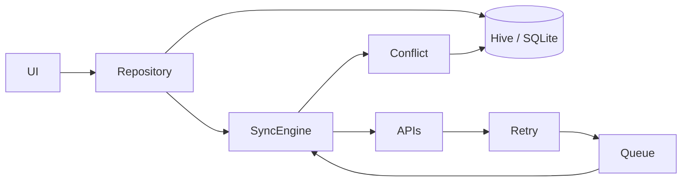

---

## 🔐 Security Architecture

The accelerator embeds security as a foundational capability across the application, ensuring that security controls are integrated into every layer of the architecture rather than treated as an afterthought. It establishes a defense-in-depth strategy that protects user data, application integrity, network communication, and backend interactions while enabling secure authentication, authorization, and data storage.

By standardizing mobile security practices, the accelerator minimizes common vulnerabilities, simplifies compliance requirements, and provides a secure foundation for enterprise-grade Flutter applications across Android and iOS platforms.

### 🧩 Best Practices

- Secure-by-design architecture
- JWT & OAuth2 authentication
- Secure token storage
- SSL/TLS certificate pinning
- Biometric authentication
- Root & jailbreak detection
- Input validation
- API request signing
- Environment-based secrets management
- Secure session management
- Automatic token refresh
- Data encryption at rest and in transit

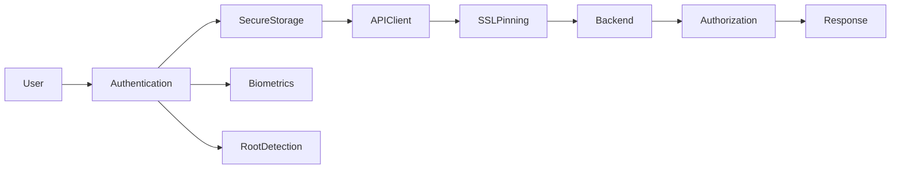

---

## 📊 Observability Architecture

The accelerator integrates observability as a core engineering capability to provide complete visibility into application behavior, user interactions, runtime performance, and production health. By standardizing logging, analytics, crash reporting, and performance monitoring, engineering teams can proactively identify issues, improve application quality, and make informed operational decisions.

The observability architecture enables centralized monitoring across development, QA, staging, and production environments while supporting real-time diagnostics and continuous improvement.

### 🧩 Best Practices

- Structured application logging
- Crash reporting
- Performance monitoring
- User analytics
- Custom event tracking
- Release monitoring
- Feature usage insights
- API monitoring
- Network diagnostics
- Environment-aware logging
- Correlation identifiers
- Centralized dashboards

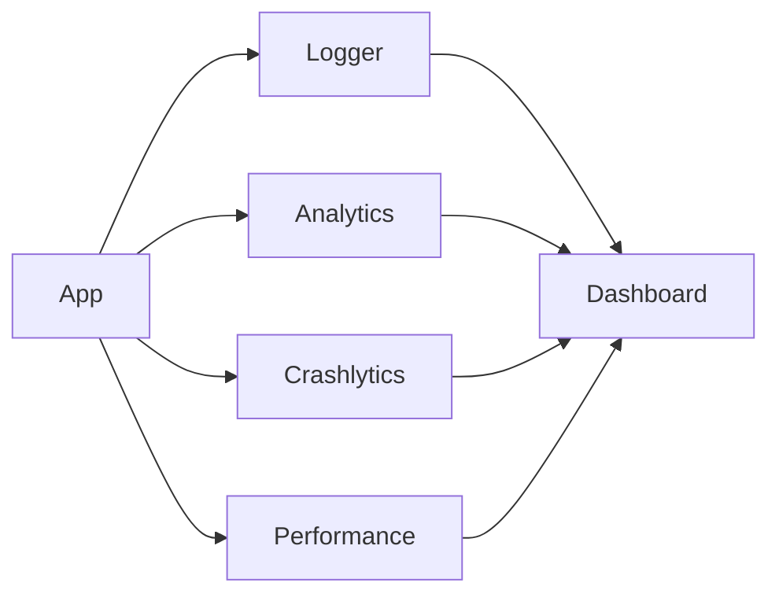

---

## 🧪 Testing Strategy

The accelerator embeds testing throughout the development lifecycle to ensure application reliability, maintainability, and confidence in every release. Rather than treating testing as a separate activity, it establishes standardized testing practices that validate business logic, user interfaces, integrations, and application workflows across all supported platforms.

By combining automated testing with continuous integration, teams can identify regressions early, improve release quality, and accelerate delivery while maintaining long-term application stability.

### 🧩 Best Practices

- Unit Testing
- Widget Testing
- Integration Testing
- End-to-End Testing
- Golden Tests
- Mocking external dependencies
- Repository testing
- Provider testing
- Continuous Integration testing
- Automated regression testing
- Code coverage reporting
- Test data management

---

## 🚢 Deployment Architecture

The accelerator defines a standardized deployment architecture that automates the journey from source code to production-ready mobile applications. It integrates continuous integration, automated testing, build generation, code signing, artifact management, and application distribution into a repeatable delivery pipeline.

This approach reduces manual effort, improves release consistency, and enables engineering teams to confidently deliver Android and iOS applications with minimal operational overhead.

### 🧩 Best Practices

- Automated CI/CD pipelines
- Multi-environment builds
- Secure code signing
- Automated testing before release
- Version management
- Build artifact management
- Firebase App Distribution
- Google Play deployment
- Apple App Store deployment
- Rollback strategy
- Release automation
- Environment-specific configuration

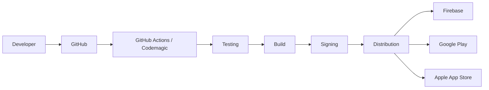

---

## 📂 Project Structure

The accelerator follows a feature-first, modular project structure designed to promote scalability, maintainability, and clear separation of concerns across enterprise Flutter applications. Each feature encapsulates its own presentation, domain, and data layers, enabling teams to develop, test, and evolve modules independently while maintaining architectural consistency across the application.

Shared infrastructure such as networking, authentication, configuration, logging, analytics, design systems, localization, and utilities are centralized to maximize reuse and reduce duplication. Documentation, templates, and testing assets are organized separately to establish repeatable engineering standards and simplify onboarding.

```
.github/                          # GitHub-related configuration
│   └── workflows/                # GitHub Actions workflows
│       └── ci-cd.yml             # CI/CD pipeline for build, test, quality checks, and deployment
│
docs/                             # Architecture and engineering documentation
│   ├── architecture/             # High-level architecture documentation
│   ├── firebase/                 # Firebase integration documentation
│   ├── networking/               # API & networking documentation
│   ├── security/                 # Security architecture documentation
│   ├── testing/                  # Testing strategy documentation
│   └── deployment/               # Deployment & CI/CD documentation
│
assets/                           # Application assets
│   ├── fonts/                    # Custom fonts
│   ├── icons/                    # Application icons
│   ├── images/                   # Images and illustrations
│   ├── animations/               # Lottie and animation assets
│   └── translations/             # Localization resources
│
lib/                              # Flutter application source
│
├── app/                          # Application bootstrap and root configuration
│   ├── app.dart                  # Root application widget
│   ├── bootstrap.dart            # Application bootstrapper
│   ├── environment/              # Environment configuration (dev, qa, uat, staging, production)
│   └── flavors/                  # Flavor-specific initialization
│
├── core/                         # Shared core infrastructure modules
│   ├── analytics/                # Analytics tracking & event management
│   ├── common/                   # Shared common abstractions and helpers
│   ├── designsystem/             # Material 3 design system & reusable UI foundation
│   ├── firebase/                 # Firebase initialization and integrations
│   ├── logger/                   # Logging and observability infrastructure
│   ├── network/                  # Dio clients, interceptors, API services
│   ├── security/                 # Security utilities and authentication helpers
│   ├── storage/                  # Hive, Drift, Secure Storage abstractions
│   ├── testing/                  # Shared testing utilities and mock helpers
│   ├── ui/                       # Shared widgets and UI utilities
│   └── utils/                    # Shared utility classes and extensions
│
├── features/                     # Feature-based application modules
│   ├── auth/                     # Authentication feature module
│   │   ├── data/                 # Repositories, APIs, DTOs, local storage
│   │   ├── domain/               # Business logic, entities, use cases
│   │   ├── presentation/         # Screens, Riverpod providers, UI state
│   │   └── di/                   # Dependency registration
│   │
│   ├── dashboard/                # Dashboard feature module
│   │   ├── data/
│   │   ├── domain/
│   │   ├── presentation/
│   │   └── di/
│   │
│   ├── home/                     # Home feature module
│   │   ├── data/
│   │   ├── domain/
│   │   ├── presentation/
│   │   └── di/
│   │
│   ├── notifications/            # Notifications feature module
│   │   ├── data/
│   │   ├── domain/
│   │   ├── presentation/
│   │   └── di/
│   │
│   └── profile/                  # User profile feature module
│       ├── data/
│       ├── domain/
│       ├── presentation/
│       └── di/
│
├── navigation/                   # Centralized navigation & routing management
│   ├── router/                   # GoRouter configuration
│   ├── routes/                   # Route definitions
│   ├── guards/                   # Authentication & access guards
│   └── deeplinks/                # Deep link handling configuration
│
├── l10n/                         # Generated localization classes
│
├── generated/                    # Generated code (Freezed, JSON serialization, etc.)
│
└── main.dart                     # Application entry point
│
test/                             # Unit and widget testing
│   ├── unit/                     # Unit tests
│   ├── widget/                   # Widget tests
│   ├── integration/              # Integration test helpers
│   └── fixtures/                 # Test fixtures and sample data
│
integration_test/                 # End-to-end integration tests
│   ├── flows/                    # User journey test scenarios
│   ├── helpers/                  # Test utilities and setup
│   ├── fixtures/                 # Test data and mocks
│   └── app_test.dart             # Application integration tests
│
android/                          # Android platform project
│   ├── app/                      # Android application module
│   ├── gradle/                   # Gradle wrapper configuration
│   ├── build.gradle              # Android build configuration
│   ├── settings.gradle           # Android project settings
│   └── gradle.properties         # Android Gradle properties
│
ios/                              # iOS platform project
│   ├── Runner/                   # Main iOS application
│   ├── Runner.xcodeproj/         # Xcode project
│   ├── Runner.xcworkspace/       # CocoaPods workspace
│   ├── Podfile                   # CocoaPods dependencies
│   └── Flutter/                  # Flutter iOS configuration
│
web/                              # Web platform project
│   ├── icons/                    # Progressive Web App icons
│   ├── favicon.png               # Browser favicon
│   ├── index.html                # Web entry point
│   └── manifest.json             # PWA manifest
│
linux/                            # Linux desktop project
│   ├── runner/                   # Linux application runner
│   ├── flutter/                  # Generated Flutter files
│   └── CMakeLists.txt            # Linux build configuration
│
macos/                            # macOS desktop project
│   ├── Runner/                   # macOS application
│   ├── Flutter/                  # Flutter macOS configuration
│   ├── Runner.xcodeproj/         # Xcode project
│   └── Runner.xcworkspace/       # CocoaPods workspace
│
windows/                          # Windows desktop project
│   ├── runner/                   # Windows application runner
│   ├── flutter/                  # Generated Flutter files
│   └── CMakeLists.txt            # Windows build configuration
│
├── pubspec.yaml                  # Flutter dependencies and asset configuration
├── analysis_options.yaml         # Dart analyzer and lint configuration
├── .gitignore                    # Git ignore rules
├── .metadata                     # Flutter project metadata
├── flutter_launcher_icons.yaml   # Launcher icon configuration
├── flutter_native_splash.yaml    # Native splash screen configuration
└── README.md                     # Project overview and architecture documentation
```

---

## 🔄 Versioning

Versioning is standardized across the accelerator using Semantic Versioning (SemVer) to provide predictable release management and backward compatibility. Application versioning is coordinated with platform-specific build numbers for Android and iOS while maintaining consistent release practices across all supported platforms.

### 🧩 Best Practices

- Semantic Versioning (SemVer)
- Platform build versioning
- Environment-based releases
- Feature version tracking
- API compatibility management
- Release notes automation

---

## 🚀 Future Enhancements

- 🌐 Flutter Web optimization
- 🖥️ Desktop platform support
- 📦 Melos monorepo support
- 🤖 AI-assisted code generation
- 🛠️ CLI project scaffolding
- 🎨 Design token generator
- 🌍 Advanced localization toolkit
- ♿ Accessibility toolkit
- 🔄 Intelligent offline synchronization engine
- 📊 Advanced observability dashboards
- 🔌 Plugin development framework
- 🧩 Micro-frontend module support

---

## 👥 Who Should Use Thynqit Accelerator

- 🚀 Startups building MVPs and scalable mobile products
- 🏢 Enterprises modernizing legacy mobile applications
- 📱 Product companies developing Android and iOS applications from a single codebase
- 👨‍💻 Engineering teams seeking standardized Flutter architecture
- 🌐 Organizations building cloud-native mobile platforms
- 🤝 Digital transformation partners delivering enterprise mobility solutions

---

## 🧠 Engineering Philosophy

At Thynqit, we believe:

- 🧠 Architecture decisions matter more than individual widgets
- 🏗️ Feature-first architecture enables long-term scalability
- 📱 Cross-platform should never compromise engineering quality
- 🔒 Security should be embedded from Day One
- 📊 Observability is a core engineering capability, not an afterthought
- ⚡ Automation accelerates delivery and improves quality
- 🧪 Testing builds confidence in every release
- 🔄 Offline-first engineering creates resilient mobile experiences
- ☁️ Cloud-native thinking extends beyond backend systems
- 🚀 Consistency across teams drives engineering velocity

---

## 📩 Work With Us

Interested in leveraging this accelerator or building scalable cross-platform mobile applications?

Thynqit partners with startups, scale-ups, and enterprises to design and deliver AI-powered, cloud-native, and enterprise-grade digital products with a strong focus on engineering excellence.

📧 connect@thynqit.com  
🌐 https://thynqit.com

---

## 🤝 Contributing

This repository is part of **Thynqit's Engineering Accelerators** and is shared publicly for reference, learning, and knowledge sharing purposes.

We do not accept external contributions, forks, or pull requests for this repository.

However, we welcome:

- 💬 Architecture and engineering discussions
- 🤝 Strategic technology partnerships
- 🚀 Product engineering engagements
- 📩 Licensing and collaboration inquiries

If you're interested in adopting similar engineering standards or partnering with Thynqit, we'd love to hear from you.

---

## 📜 License

This project is licensed under a **Proprietary License (All Rights Reserved)**.

You may:

- View and reference the material

You may NOT:

- Copy, modify, distribute, or use in production without explicit permission